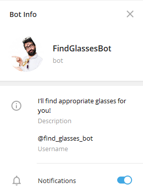
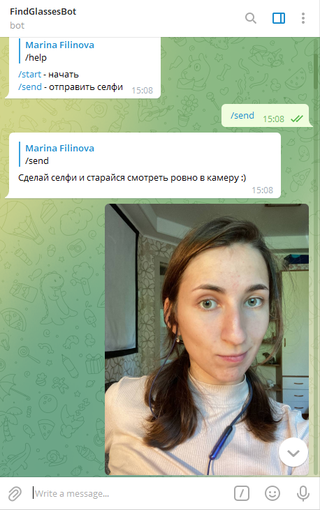
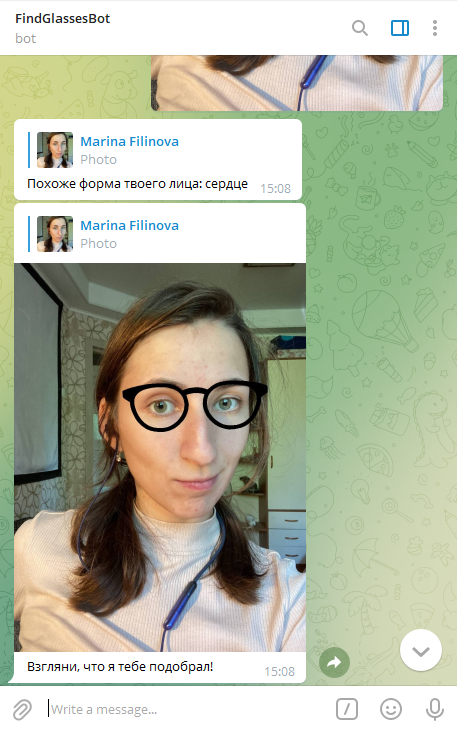
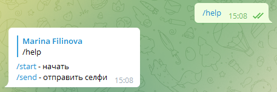

<h1 align="center">FindGlassesBot</h1>

## Description

FindGlassesBot implemented on Python and works with Telegram (username: @find_glasses_bot). It will help you find glasses, that appropriate to your face.

## How to use

### Commands:

- **/send**  to send your file with selfie
- **/start** start talking with bot
- **/help**  to get help

/send example:

and it's result:

/help example:

## Future scope

- Add new glasses
- Make better face shape recognition

https://core.telegram.org/bots/api
